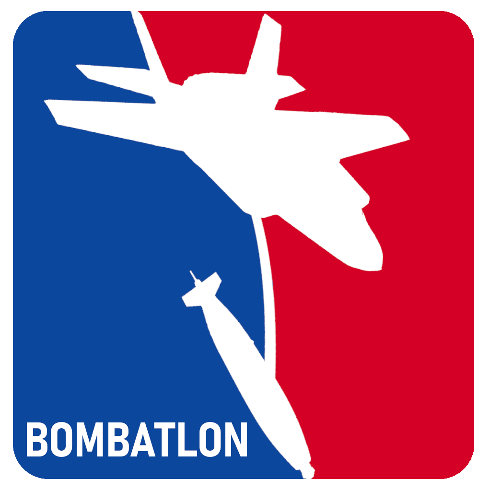

# MSFS Manual Bombing Leegue - MBL (Bombathlon)

**MSFS Campaign Project for Manual Bombing Challenges**

Welcome to **msfs-MBL**, a project focused on integrating manual bombing challenges into Microsoft Flight Simulator (MSFS). 
Drawing inspiration from biathlon, MBL introduces a series of engaging missions where players can participate in bombing runs to destroy scattered targets across the global landscape. 
Successfully completing these challenges rewards players with access to new aircraft and equipment.

## Purpose and Motivation

### Driving Force

Microsoft Flight Simulator provides a vast sandbox for virtual pilots to explore an array of aircraft in diverse locations worldwide. Although the platform offers a selection of challenges, there's a need for more extensive, campaign-style experiences.
While civil aviation remains the primary focus, the inclusion of military aircraft opens the door to new opportunities.
Despite the increasing availability of combat planes in MSFS, users often find themselves lacking substantial objectives beyond airshows, intercepts, and scenic flights. 
Although tools like NeoFly offer intercept missions, they lack a comprehensive framework for military career progression within the global context of MSFS.  

This is where MBL and its successors come into play. These tools aim to provide purposeful combat-oriented missions, effectively utilizing the available military aircraft. 
MBL's primary objective is to deliver manual bombing challenges spread across the MSFS world map, allowing players to demonstrate their piloting and bombing skills. 
This initiative serves as a foundation for potential future developments, including a full-fledged capture-and-hold combat environment for conquering the globe of MSFS.

### Project Scope

MBL and its successors do not aim to replicate the complexity of dedicated combat simulations like DCS. 
Instead, they emphasize accessible and engaging combat experiences, resembling sports competitions more than realistic battlefield scenarios.
While MBL incorporates elements of combat simulation, it intentionally maintains a simplified approach concerning system depth, physics simulation, and targeting systems. 

## Description

Players can participate in Bombing Competitions using their military planes.
Players can found or join a squadron and choose a base Airport. 
The first plane model of a Squadron is free. Other plane models can be unlocked by earning points in bombing missions.
Bigger Airports are limited to squadrons with more members to encourage cooperation and limit squadrons focusing on the big international hubs.
Additional Airports can be unlocked using Points.
All bombing Missions must start at the airport of a players location an end at a squadrons airport.  

Bombing Targets spawn in random Locations all over the map.
Each target has a set size an amount of structural integrity or "health".
Players deal damage to a target by dropping bombs based on bomb size and drop accuracy.
Squadrons goin Point proportional to the damage dealt to a target.
Upon destruction the Squadron that dealt the most damage to the target receives bonus points.  

Bombing Targets might have a limit for planes time period. This should give older WW1, WW2 or Cold War planes a chance to score points since they carry less bombs and do not fly supersonic.  

To Require some skill only Manual Bombing is supported.  

All of these features my change due to technical reasons or balancing.  

As a last additional step Targets might get protected by Air defense. This is more a preparation for the successor and not clear yet.  

## Features
- Squadron Management
- Manual Bombing Missions
- Unlocking Plane Model
- Unlocking Airfield
- Unlocking Bomb types
- Scoreboard
- Bomb launch review (optional)
- Target defenses (optional)
- Flight Plan export (optional)

## Technical Documentation

### Architecture

MBL will consist of the core components:
- MSFS Client
- Backend Server
- Database
- WebInterface

#### MSFS Client

C# Application using SimConnect
Connected to Server via http rest, websocket or MQTT

collects and pushes MSFS aircraft data
- position
- speed
- payload
- fuel

catches Bomb Launch Event

changes payload on bomb launch (experimental)

#### Backend Server

Python application with REST API?

monitors flight data
calculates bomb launch, impact and damage
manages squadrons
anti cheat detection (experimental)
creates Targets

#### Database

Database?
- Cockroach DB? 
  Request Units 50 Million
  Storage 10 GB
- MongoDB
  512MB to 5GB of storage
  Shared RAM
- InfluxDB
  30 Tage
  Only for temporal Data
  - flights
  - stats
  - drops
  - scores
  
stores:
- Users
- Squadrons
- Plane Models
- Bomb Types
- Targets
- Bomb Launch Events
- Hit Events

##### Web Interface

React? ViewJS? Electron? 

Web App?
- login (Basic?, Token?)
- User Management
- Squadron Management
- Scoreboard
- Bomb launch review (optional)
- Flight Plan export (optional)

## Successor "MBL Conquest"

This project is a technical prototype for a way bigger idea for a capture and hold combat environment.
Players join a squadron and start a home Airport.
From there on resources can be uses to build defenses (SAM).
Troops, resources and planes can be transported to other airfields to capture them.
The maximum size of airfields depends on the size of the squadron to encourage cooperation.
Players can destroy enemy defenses or facilities holding resources to weaken the enemy and enable conquering an enemy airfield.
Players can engage planes in BVR air-to-air combat to defend their territory.
Systems like Radar, RWR, Weapons Page or HUD (for CCIP) should be displayed as toolbar item if possible.

### Features
- Squadron Management
- Resource transport
- Troop transport
- Building defenses: SAM sides
- Deploying Manpads
- SEAD Missions (HARM)
- Bombing Missions (GPS / CCRP / Manual)
- BVR Combat 
  - Basic Doppler Radar
  - Radar cross-section
  - Beaming and Notching
  - Basic RWR
  - Basic Countermeasures
- Basic Aircraft Damage

More Information follows in separate project.

## Technical Difficulties and Limitations

- no API to access Terrain: difficult implementation of collisions and line of sight checks

## Community

If you are interested in the progress of this project join the discord: [Bombathlon Discord](https://discord.gg/Q8cQ5nhC)

## Collaboration

this is a quite big project. If you want to help develop it feel free to contact me on Discord.

skills needed:
- Frontend Web Developer
- C# Developer (object Placement using SimConnect)
- Moderators
- Data Contributors (bomb weights & drag, plane radar cross-sections)

## License

